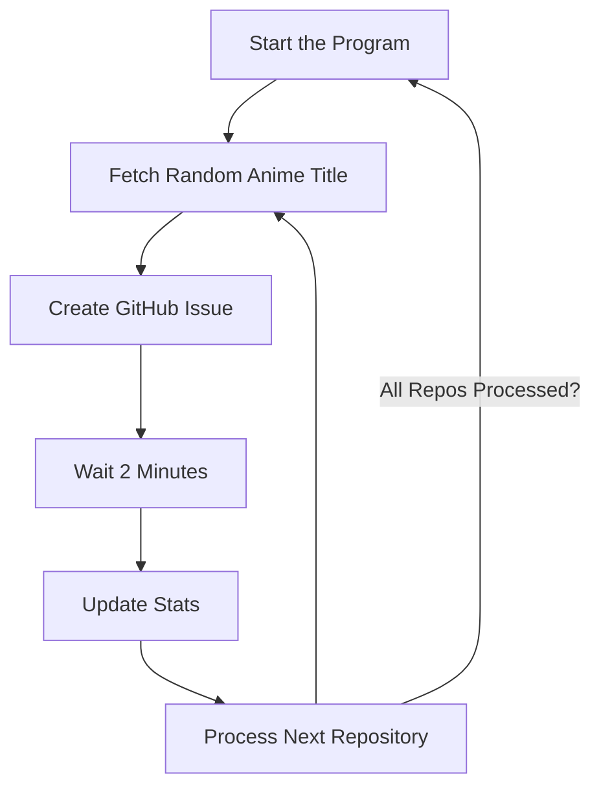

# 🐉 Anime Issue Creator 🐾

Welcome to the **Anime Issue Creator**, a meme-worthy program designed to bring chaos and joy to your friends' GitHub repositories. This masterpiece fetches random anime titles and creates new issues in your specified repositories, looping forever to ensure maximum "productivity." 🎉

---

## ✨ Features

- 🚀 **Automated Issue Creation**: Generates GitHub issues with random anime titles.
- 🎨 **Anime Themes**: Uses the [Jikan API](https://jikan.moe/) to fetch top anime titles.
- 📊 **Progress Stats**: Tracks the total number of issues created in a session.
- ⏳ **Progress Bar**: Waits for 2 minutes between issue creation with a fancy countdown.
- ♻️ **Endless Looping**: Keeps creating issues for your friends… forever.
- 🐳 **Docker Support**: Easily run this program in an isolated container.
- 💥 **Error Resilience**: Skips errors gracefully like a true anime protagonist.

---

## 🛠️ Installation

### Method 1: Run Locally
1. Clone the repository:
   ```bash
   git clone https://github.com/your-username/anime-issue-creator.git
   cd anime-issue-creator
   ```

2. Install dependencies:
   ```bash
   pip install requests tqdm
   ```

3. Add your [**GitHub Personal Access Token**](https://github.com/settings/tokens) to the script:
   ```python
   GITHUB_TOKEN = "your_personal_access_token_here"
   ```

4. Run the script:
   ```bash
   python anime-issue-creator.py
   ```

---

### Method 2: Run with Docker 🐳

1. Clone the repository:
   ```bash
   git clone https://github.com/your-username/anime-issue-creator.git
   cd anime-issue-creator
   ```

2. Create a `.env` file in the root of the project to store your GitHub token:
   ```bash
   echo "GITHUB_TOKEN=your_personal_access_token_here" > .env
   ```

3. Build the Docker image:
   ```bash
   docker build -t anime-issue-creator .
   ```

4. Run the container:
   ```bash
   docker run --env-file .env anime-issue-creator
   ```

5. Sit back and watch your friends' repositories fill up with anime-inspired issues.

---

## 🎉 Example Output

```
Processing repository: tmarktg/Calculator-Beta
Fetching anime title... 🎥
Anime Title: Attack on Titan
Creating issue in tmarktg/Calculator-Beta: Attack on Titan
Issue created successfully in tmarktg/Calculator-Beta: Attack on Titan
Total Issues Created: 1
Waiting 2 minutes before the next issue...
```

---

## 📖 How It Works

1. Fetches a random anime title from the Jikan API.
2. Creates a new GitHub issue in the selected repository.
3. Waits for 2 minutes with a fancy progress bar.
4. Repeats the process endlessly for maximum fun.

---

## 🤔 Why?

Because your friends need more issues in their lives—preferably anime-themed ones.

---

## 🌸 Anime Appreciation Section

A random selection of anime titles you might encounter in your issues:
- **Naruto**
- **Attack on Titan**
- **My Hero Academia**
- **One Piece**
- **Demon Slayer**
- **Dragon Ball Z**
- **Fullmetal Alchemist: Brotherhood**

---

## 🔥 Flowchart of Chaos



---

## 🐾 Contributing

Want to add more chaos? Feel free to submit a pull request with your own anime-inspired features!

---

## ⚠️ Disclaimer

Use responsibly! This program is for fun and entertainment purposes only. Be mindful of GitHub's API rate limits and your friends' sanity. 🙃
